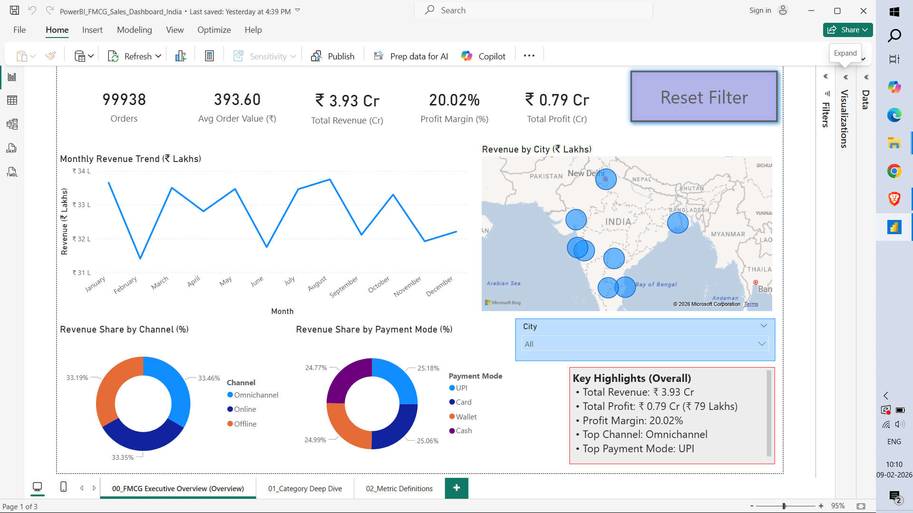

# FMCG Sales & Profitability Dashboard (Power BI) - India (2024)
This project is an interactive Power BI report built on an Indian FMCG retail dataset (2024). The goal is to present a clean, business-style dashboard that helps quickly understand **sales performance and profitability** and explore results by **city, category, brand, channel, and payment mode**.

## What this dashboard answers
- How much **revenue** and **profit** did we generate?
- What is the **profit margin %** overall and by segment?
- How many **orders** happened and what is the **average order value (AOV)**?
- Which **cities** contribute the most revenue?
- Which **categories/brands** drive revenue and profit?
- How does performance change **month by month**?
- What are the most common **sales channels** and **payment modes**?

## Dashboard pages
### 1) Executive Overview
A high-level page for quick decision-making:
- KPI cards: **Orders, AOV, Total Revenue (₹ Cr), Profit Margin %, Total Profit (₹ Cr)**
- **Monthly Revenue Trend** (line chart)
- **Revenue by City** (map)
- **Revenue split by Channel** (donut)
- **Revenue split by Payment Mode** (donut)
- **City slicer** + **Reset Filter** button for easy interaction

### 2) Category Deep Dive
A detailed breakdown of what is driving performance:
- **Revenue by Category (₹ Lakhs)**
- **Profit by Category (₹ Lakhs)**
- **Top Brands by Revenue (₹ Lakhs)**
- Key highlights section to summarize takeaways from the view

### 3) Metric Definitions
A simple reference page that explains:
- What each KPI means
- How each metric is calculated
- How to use the report (filters + reset)

## KPIs and calculations (DAX measures)
These are the main measures used in the report:
- **Total Revenue** = SUM(Revenue)  
- **Total Profit** = SUM(Margin) *(Margin is treated as profit in this dataset)*  
- **Profit Margin %** = Total Profit ÷ Total Revenue  
- **Orders** = DISTINCTCOUNT(Invoice_ID)  
- **Average Order Value (AOV)** = Total Revenue ÷ Orders  

**Why units differ (intentional):**
- KPI cards use **Crores (₹ Cr)** for a clean executive summary.
- Charts use **Lakhs (₹ Lakhs)** to make differences between categories/brands easier to see visually.
  
## How to use the report
1. Use the **City slicer** to filter all visuals.
2. Use the **Reset Filter** button to go back to the default view.
3. Start with **Executive Overview** to understand the big picture.
4. Go to **Category Deep Dive** to identify what’s driving the numbers.
5. Use **Metric Definitions** if you want to understand how KPIs are calculated.

## Key Insights (from report)
- Strong overall profitability at **20.02% margin** with **₹ 3.93 Cr revenue**.
- Category comparison shows **Fruits lead revenue**, while **Grocery leads profit**.
- **ITC** is the top brand by revenue in the deep-dive view.
- Channel and payment mix visuals help understand purchasing behavior (Top: Omnichannel, UPI).

## Dataset
Source: Kaggle - **Indian FMCG Retail Sales, Customer & Inventory (2024)**

## Tools used
- **Power BI Desktop**
- Power Query (basic cleaning + data type checks)
- DAX (basic measures: `SUM`, `DISTINCTCOUNT`, `DIVIDE`)
- Slicers, cards, line chart, donut charts, bar charts, map visual
- Bookmarks + button for reset functionality

## How to open the PBIX
- Download → open in Power BI Desktop → use **City slicer** → reset
    
## Author
Yash Bhosle 
| Email: yashbhosle.work@gmail.com

## Screenshots

## Executive Overview

## Category Deep Dive

## Metric Definitions

